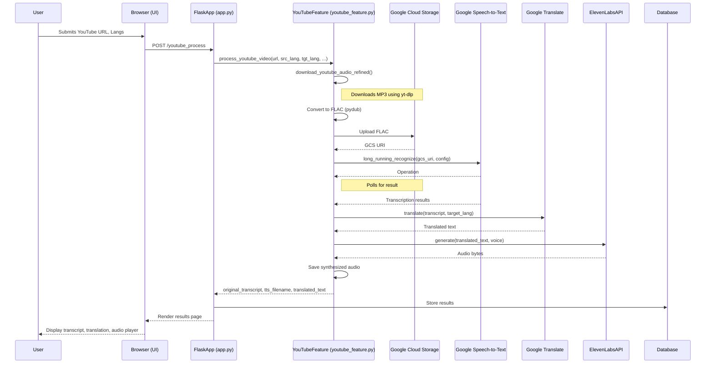

# Project Documentation: voice_trans

## Chapter 3: Objective

This project, "voice_trans," aims to provide a comprehensive solution for voice transcription, translation, and speech synthesis. The primary goal is to offer users a platform where they can easily convert spoken audio from various sources (initially focusing on YouTube videos and potentially direct audio uploads) into text, translate this text into different languages, and then generate spoken audio of the translated content.

The key objectives are:
1.  To develop a user-friendly web application for seamless audio processing.
2.  To integrate robust speech-to-text capabilities for accurate transcription of audio content from YouTube videos and uploaded files.
3.  To incorporate reliable machine translation services to translate transcribed text into a variety of target languages.
4.  To implement text-to-speech functionality to synthesize natural-sounding audio from translated text, offering users an end-to-end voice transformation experience.

## Chapter 4: Proposed Method/Technique

### 1.1. Proposed Algorithm/Technique

The system employs a microservices-inspired architecture, leveraging specialized external APIs and libraries for core functionalities:

*   **Audio Acquisition (YouTube):** `yt-dlp` library is used to download audio streams from YouTube videos. This tool is robust and handles various YouTube URL formats and extracts the best quality audio.
*   **Audio Format Conversion:** The `pydub` library is utilized for audio manipulation, specifically for converting downloaded audio (e.g., mp3, m4a) into the FLAC format, which is preferred by Google Cloud Speech-to-Text for optimal accuracy, especially for long audio files.
*   **Speech-to-Text (Transcription):** Google Cloud Speech-to-Text API (specifically the `long_running_recognize` method) is employed for transcribing audio content. This service is chosen for its accuracy, support for numerous languages, and ability to handle long audio files by processing them asynchronously after they are uploaded to Google Cloud Storage (GCS).
*   **Machine Translation:** Google Cloud Translate API is used for translating the transcribed text. This API provides a wide range of language support and high-quality translations.
*   **Text-to-Speech (Speech Synthesis):** ElevenLabs API is integrated to generate natural-sounding speech from the translated text. ElevenLabs is known for its high-fidelity voice cloning and synthesis capabilities, offering a more human-like audio output.
*   **Web Framework:** Flask, a Python micro web framework, is used for the backend development, handling HTTP requests, routing, user authentication, and interaction with the database.
*   **Database:** PostgreSQL (indicated by `psycopg2-binary`) is used as the relational database, managed via Flask-SQLAlchemy, to store user information, processing history, and potentially other application data.

### 1.2. Proposed System Design

The system is designed as a web application with the following key components:

1.  **User Interface (Frontend):** Developed using HTML, CSS, and JavaScript (likely within Flask templates found in the `templates` directory). It provides pages for:
    *   User authentication (Login, Signup, Change Password).
    *   YouTube video processing (inputting URL, selecting languages).
    *   Direct audio/text translation (likely, based on `translate.html`).
    *   Viewing processing history.
2.  **Backend (Flask Application - `app.py`):**
    *   Handles user requests from the frontend.
    *   Manages user authentication and sessions (Flask-Login).
    *   Orchestrates the audio processing pipeline:
        *   Receives YouTube URLs or uploaded audio files.
        *   Calls `youtube_feature.py` (or similar modules for other audio sources) to perform download, conversion, transcription, translation, and TTS.
        *   Interacts with Google Cloud services (Speech-to-Text, Translate, Storage) and ElevenLabs API.
        *   Stores results and metadata in the PostgreSQL database.
    *   Serves processed audio files and translated text to the user.
3.  **Audio Processing Module (`youtube_feature.py`):**
    *   Contains the logic for handling YouTube video processing as described in section 1.1.
    *   Manages temporary file storage and cleanup (local and GCS).
4.  **External Services:**
    *   Google Cloud Platform:
        *   Speech-to-Text API.
        *   Translate API.
        *   Cloud Storage (for temporary storage of audio files for transcription).
    *   ElevenLabs API: For text-to-speech synthesis.
5.  **Database (PostgreSQL):**
    *   Stores user credentials.
    *   Maintains a history of transcription and translation tasks, including original text, translated text, and links to generated audio files.

**Data Flow (YouTube Video Example):**
1.  User submits a YouTube URL and selects source/target languages via the web UI.
2.  Flask backend receives the request.
3.  `download_youtube_audio_refined` in `youtube_feature.py` downloads the audio using `yt-dlp` and saves it locally (e.g., as MP3).
4.  The audio is converted to FLAC format using `pydub`.
5.  The FLAC file is uploaded to Google Cloud Storage.
6.  Google Cloud Speech-to-Text API is called with the GCS URI of the FLAC file for long-running transcription.
7.  The transcribed text is retrieved.
8.  The transcribed text is sent to Google Cloud Translate API for translation.
9.  The translated text is sent to ElevenLabs API for speech synthesis.
10. The synthesized audio (e.g., MP3) is saved, and its path/link, along with the original and translated text, is stored in the database and presented to the user.
11. Temporary files on the local system and GCS are cleaned up.

### 1.3. Functional and Nonfunctional Requirements

**Functional Requirements:**

*   **User Registration and Authentication:**
    *   FR1: Users must be able to create an account.
    *   FR2: Users must be able to log in with their credentials.
    *   FR3: Users should be able to change their password.
*   **YouTube Video Processing:**
    *   FR4: The system must allow users to input a YouTube video URL.
    *   FR5: The system must allow users to select the source language of the video.
    *   FR6: The system must allow users to select the target language for translation.
    *   FR7: The system must download audio from the YouTube video.
    *   FR8: The system must transcribe the downloaded audio into text.
    *   FR9: The system must translate the transcribed text into the selected target language.
    *   FR10: The system must synthesize the translated text into audible speech.
    *   FR11: The system must present the original transcript, translated text, and the synthesized audio to the user.
*   **Direct Audio Upload and Processing (Assumed based on `translate.html`):**
    *   FR12: The system should allow users to upload audio files (e.g., MP3, WAV).
    *   FR13: The system should allow users to select the source language of the uploaded audio.
    *   FR14: The system should transcribe the uploaded audio.
    *   FR15: (If translation desired) The system should allow users to select a target language for the transcript.
    *   FR16: (If translation desired) The system should translate the transcript.
    *   FR17: (If TTS desired) The system should synthesize the original or translated transcript into speech.
*   **History:**
    *   FR18: The system must store a history of user's processing tasks (transcriptions, translations, synthesized audio links).
    *   FR19: Users must be able to view their processing history.
*   **Language Support:**
    *   FR20: The system must support a wide range of languages for transcription, translation, and (where possible) TTS, based on the capabilities of the integrated APIs.

**Nonfunctional Requirements:**

*   **Performance:**
    *   NFR1: Audio download and conversion should be completed within a reasonable timeframe (e.g., < 2 minutes for a 10-minute video, dependent on network and external service speed).
    *   NFR2: Transcription of a 10-minute audio file should ideally be processed within 5-10 minutes (dependent on Google Cloud Speech API).
    *   NFR3: Translation and TTS should be near real-time after transcription is complete (seconds).
    *   NFR4: The web interface should be responsive, with page load times under 3 seconds.
*   **Accuracy:**
    *   NFR5: Transcription accuracy should be high, leveraging Google's advanced speech recognition models.
    *   NFR6: Translation accuracy should be high, relying on Google Translate.
*   **Usability:**
    *   NFR7: The user interface should be intuitive and easy to navigate.
    *   NFR8: Error messages should be clear and helpful.
*   **Reliability:**
    *   NFR9: The system should handle errors gracefully (e.g., invalid YouTube URL, API failures) and provide appropriate feedback to the user.
    *   NFR10: The system should ensure proper cleanup of temporary files to avoid storage issues.
*   **Security:**
    *   NFR11: User passwords must be securely hashed (e.g., using bcrypt).
    *   NFR12: API keys and sensitive credentials must be stored securely (e.g., using environment variables via `python-dotenv` and `key.py`).
*   **Scalability:**
    *   NFR13: The system should be able to handle multiple concurrent users, primarily limited by API rate limits and server resources. Using GCS for intermediate storage and asynchronous operations helps.
*   **Maintainability:**
    *   NFR14: Code should be well-organized (e.g., `youtube_feature.py` for specific logic) and commented where necessary.
    *   NFR15: Dependencies should be managed via `requirements.txt`.

## Chapter 5: Detailed Methodology

*(This section would typically require a deeper dive into `app.py` and database schema, which is currently limited. The following are based on inferences and common practices for such an application.)*

### 1.1. ER diagrams, DFDs, UMLs (with few lines of description)

**ER Diagram (Conceptual):**

```
+-------------+       +-------------------+       +---------------------+
|   User      |-------|  ProcessingTask   |-------|  TaskOutput         |
+-------------+       +-------------------+       +---------------------+
| PK UserID   |       | PK TaskID         |       | PK OutputID         |
| Username    |       | FK UserID         |       | FK TaskID           |
| PasswordHash|       | TaskType          |       | OutputType          |
| Email       |       | CreationTimestamp |       | TextContent (LOB)   |
| ...         |       | SourceLanguage    |       | AudioFilePath       |
+-------------+       | TargetLanguage    |       | ...                 |
                        | InputSource (URL/file)|       +---------------------+
                        | Status            |
                        | ...               |
                        +-------------------+
```

*   **Description:**
    *   **User:** Stores user account information. `PasswordHash` for security.
    *   **ProcessingTask:** Represents a single job initiated by a user (e.g., process a YouTube video, translate an uploaded file). It links to the `User` and stores metadata like task type, languages, input source, and status.
    *   **TaskOutput:** Stores the results of a `ProcessingTask`. A single task might have multiple outputs (e.g., original transcript, translated text, synthesized audio file path). `OutputType` could be 'transcript', 'translation', 'tts_audio'. `TextContent` can store large text data.

**Data Flow Diagram (DFD) - Level 0 (Context Diagram):**

```
                        +-------------------------+
                        |                         |
User ---Request------>  |   Voice Trans System    |  ---Processed Output---> User
 (Video URL, Audio File,|                         |   (Text, Audio)
  Language Selections)  +-------------------------+
                              ^      |
                              |      | API Calls (Speech, Translate, TTS)
                              |      v
                        +-------------------------+
                        |   External Services     |
                        | (Google Cloud, ElevenLabs)|
                        +-------------------------+
```

*   **Description:** The user interacts with the "Voice Trans System" by providing inputs. The system interacts with "External Services" to perform core tasks and then delivers the processed output back to the user.

**UML Use Case Diagram (Simplified):**

```
        +-----------------------------------+
        | Actor: User                       |
        +-----------------------------------+
                  |
                  |
  ---------------------------------------------------
  |                                                 |
  |  +-----------------------------------------+    |
  |  | Use Case: Process YouTube Video         |    |
  |  |   Includes:                             |    |
  |  |     - Download Audio                    |    |
  |  |     - Transcribe Audio                  |    |
  |  |     - Translate Text                    |    |
  |  |     - Synthesize Speech                 |    |
  |  +-----------------------------------------+    |
  |                                                 |
  |  +-----------------------------------------+    |
  |  | Use Case: Process Uploaded Audio (Basic)|    |
  |  |  (Assumed: Similar steps to YouTube)    |    |
  |  +-----------------------------------------+    |
  |                                                 |
  |  +-----------------------------------------+    |
  |  | Use Case: Manage Account                |    |
  |  |   Includes:                             |    |
  |  |     - Register                          |    |
  |  |     - Login                             |    |
  |  |     - Change Password                   |    |
  |  +-----------------------------------------+    |
  |                                                 |
  |  +-----------------------------------------+    |
  |  | Use Case: View History                  |    |
  |  +-----------------------------------------+    |
  |                                                 |
  ---------------------------------------------------

```
*   **Description:** Shows the main interactions (use cases) a `User` can have with the system, such as processing YouTube videos, managing their account, and viewing history. The "Process YouTube Video" use case is detailed with its sub-functions.

### 1.2. Any other diagrams

**Sequence Diagram (Simplified - YouTube Video Processing):**



*   **Description:** This sequence diagram illustrates the flow of interactions between different components when a user requests to process a YouTube video. It shows the calls to `youtube_feature.py`, external Google Cloud services, and ElevenLabs API.

## Chapter 6: Result and Discussion

### 5.1. Project outputs with discussion

The primary outputs of the "voice_trans" project are:

1.  **Transcribed Text:**
    *   **Output:** Plain text generated from the audio source (YouTube video or uploaded file).
    *   **Discussion:** The accuracy of this output is heavily dependent on the quality of the source audio and the capabilities of the Google Cloud Speech-to-Text API. The use of `enable_automatic_punctuation=True` and selection of the correct `source_lang_code` are crucial for obtaining well-formatted and accurate transcriptions. For long audio, the asynchronous processing via GCS ensures the application remains responsive.

2.  **Translated Text:**
    *   **Output:** Plain text translated from the original transcript into the user-selected target language.
    *   **Discussion:** The quality relies on Google Cloud Translate. Providing both source and target language codes can improve translation accuracy. The system also handles HTML unescaping from the translation output to ensure clean text.

3.  **Synthesized Speech (Translated Audio):**
    *   **Output:** An audio file (e.g., MP3) containing the spoken version of the translated text.
    *   **Discussion:** The naturalness and quality of this audio depend on the ElevenLabs API, the chosen voice (`elevenlabs_voice_id`), and the model (`eleven_multilingual_v2`). This output provides a direct audible representation of the translation, completing the voice transformation cycle. The generated audio files are stored (e.g., in the `UPLOAD_FOLDER`) and made accessible to the user for playback.

4.  **User Interface for Interaction:**
    *   **Output:** Web pages (`youtube.html`, `translate.html`, `history.html`, etc.) that allow users to input data, select options, view results, and manage their accounts.
    *   **Discussion:** The UI aims to be intuitive. Users can input YouTube URLs, select languages from dropdowns, and receive feedback on the processing status. The history page allows users to revisit previous work.

**Key Discussion Points:**

*   **Integration of Multiple Services:** The project successfully integrates several external APIs. Managing API keys, error handling for each service, and orchestrating the workflow are critical aspects. The use of `current_app.logger` for logging at each step is good practice for debugging and monitoring.
*   **Handling Long Audio:** The implementation in `youtube_feature.py` correctly uses Google Cloud Storage for staging audio files before calling the `long_running_recognize` method of the Speech-to-Text API. This is essential for audios exceeding the typical limits for synchronous recognition. The `GCS_OPERATION_TIMEOUT` ensures the application doesn't hang indefinitely.
*   **Temporary File Management:** The `finally` block in `process_youtube_video` is crucial for cleaning up temporary local files (downloaded audio, converted FLAC) and the GCS blob. This prevents accumulation of unnecessary data and associated costs.
*   **User Experience:** The system provides feedback through status messages and eventually presents all relevant outputs (original transcript, translation, and synthesized audio). The asynchronous nature of some operations (like transcription) means the UI needs to handle waiting states gracefully (though the specifics of this are in `app.py` and frontend JavaScript, which were not fully reviewed).

### 5.2. Comparative studies (if any)

A formal comparative study against other existing platforms (e.g., Descript, Happy Scribe, or direct usage of individual cloud services) is not evident from the codebase alone. However, we can infer some comparative aspects:

*   **Customization and Control:**
    *   **voice_trans:** Offers a tailored workflow by integrating specific best-of-breed services (Google for STT/Translate, ElevenLabs for TTS). This allows for potential cost optimization or specific feature choices not available in off-the-shelf monolithic solutions.
    *   **Other Platforms:** Might offer a more integrated, potentially simpler user experience but with less flexibility in choosing underlying service providers or specific models.

*   **Cost:**
    *   **voice_trans:** Costs would be directly tied to the usage of Google Cloud (Speech, Translate, Storage) and ElevenLabs APIs. This can be cost-effective for users with existing Google Cloud credits or specific needs that align with these services' pricing.
    *   **Other Platforms:** Typically have subscription-based pricing, which might be simpler to manage but potentially more expensive for sporadic use.

*   **Feature Set:**
    *   **voice_trans:** Focuses on a core pipeline: YouTube/upload -> transcribe -> translate -> TTS. The `youtube_feature.py` is highly specialized.
    *   **Other Platforms:** May offer additional features like in-app editing of transcripts, speaker diarization, collaboration tools, etc., which are not apparent in the current "voice_trans" codebase.

*   **Self-Hosting and Data Privacy:**
    *   **voice_trans:** As a self-hosted or privately deployed application (if the user chooses to run it on their own infrastructure), it could offer more control over data privacy compared to sending data to third-party all-in-one services. However, it still relies on external cloud APIs for the core processing.

*   **Ease of Use vs. Technical Overhead:**
    *   **voice_trans:** Requires setup (Python environment, API keys, potentially database setup).
    *   **Other Platforms:** SaaS solutions are generally easier to start using immediately.

**Potential areas for future comparative analysis if the project were to be benchmarked:**

*   **Transcription Accuracy:** Compare Google Cloud Speech (as used here) against Whisper, AssemblyAI, etc., for specific audio types.
*   **Translation Quality:** Compare Google Translate against DeepL or other services for relevant language pairs.
*   **TTS Naturalness:** Compare ElevenLabs against Google WaveNet voices, Amazon Polly, Microsoft Azure TTS.
*   **Overall Processing Time:** Benchmark the end-to-end pipeline against other tools.
*   **Cost-Effectiveness:** For a defined workload, compare the API costs of this system versus the subscription costs of alternatives.

This concludes the initial generation of the project documentation. 